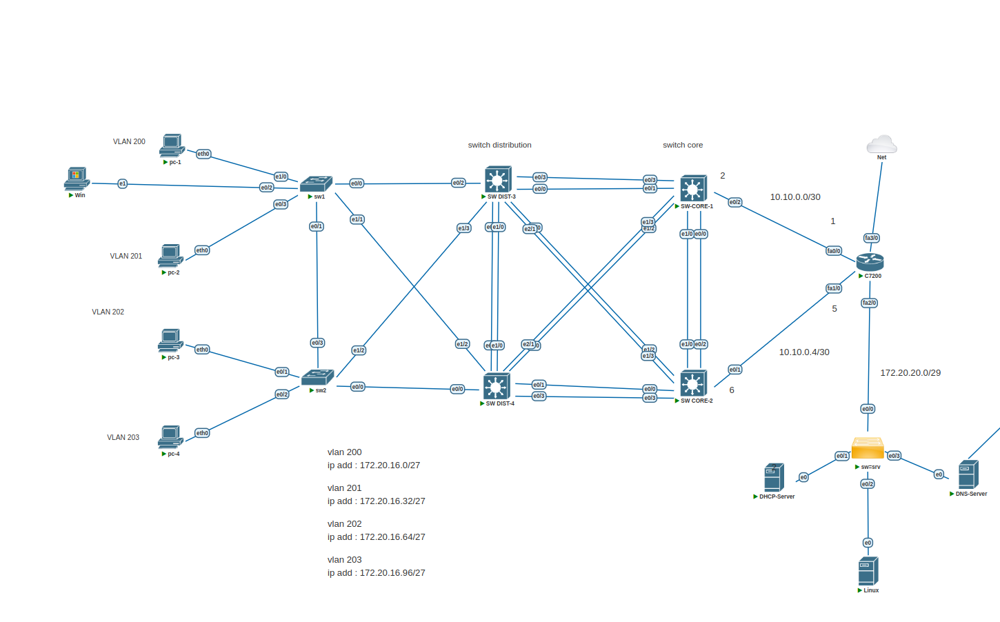

This project is designed for the implementation and testing of **Hot Standby Router Protocol (HSRP)** in a network environment. 
The purpose of this project is to create a **reliable and resilient network** using HSRP to enhance **accessibility and flexibility** in organizational networks.

## 🎯 Project Objectives  
- Project Objectives
- Configure HSRP between multiple routers to improve network stability and availability

- Test Failover and recovery in case of router failure
  
- Use dhcp server linux to assign ip add to client
and dns server for domain resolution and managing various types of DNS records.

- ## 🔧 Features
- The topology consists of two **core switches** configured with HSRP and a router as the network edge, one of which is the client network and the other is the server, and the other is the WAN container, 
    which is used for the Internet clients using NAT ACL and full control is placed on the LAN network.
- Using **Linux DHCP Server** to assign IP addresses
- Using **Linux BIND Server** for name resolution and client access to public sites with BIND SERVER
- Fully tested scenario with regard to possible errors and various tests

- ## 🛠️ Technologies
- **HSRP (Hot Standby Routing Protocol)**
- **Linux DHCP Server**
- **Linux Bind Server**
- **Cisco Switches**
- **Cisco Routing**

** Image **

📈 Test Results
This project is used to test the HSRP functionality and its failover capability. In case of a Switch failure, HSRP should failover to the second router, and the default IP address for clients should remain consistent.

🧑‍💻 Contribute
If you're interested in contributing to this project, please submit a pull request or report Issues.
