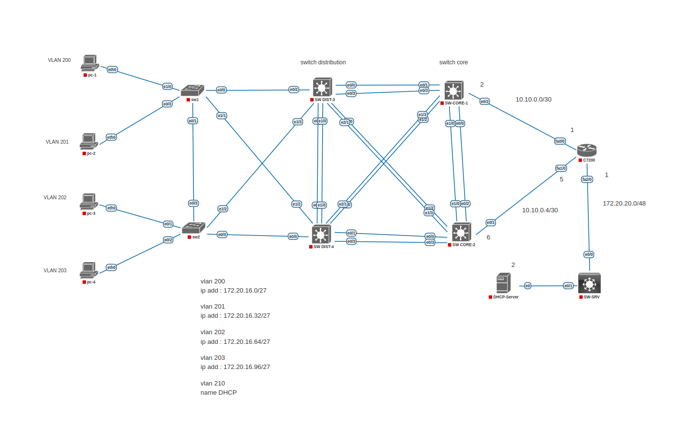

This project is designed for the implementation and testing of **Hot Standby Router Protocol (HSRP)** in a network environment. 
The purpose of this project is to create a **reliable and resilient network** using HSRP to enhance **accessibility and flexibility** in organizational networks.

## 🎯 Project Objectives  
- Configure **HSRP** between multiple routers to improve **network stability** and **availability**  
- Test **failover** and **recovery** in case of router failure

- ## 🔧 Features
- Topology includes two **switch-core** configured with HSRP  
- Use of **Linux DHCP Server** for IP address allocation    
- Fully tested scenario with attention to potential errors and various tests

- ## 🛠️ تکنولوژی‌ها
- **HSRP**  
- **Linux DHCP Server**  
- **Cisco Switches**  

** Image **

📈 Test Results
This project is used to test the HSRP functionality and its failover capability. In case of a Switch failure, HSRP should failover to the second router, and the default IP address for clients should remain consistent.

🧑‍💻 Contribute
If you're interested in contributing to this project, please submit a pull request or report Issues.
